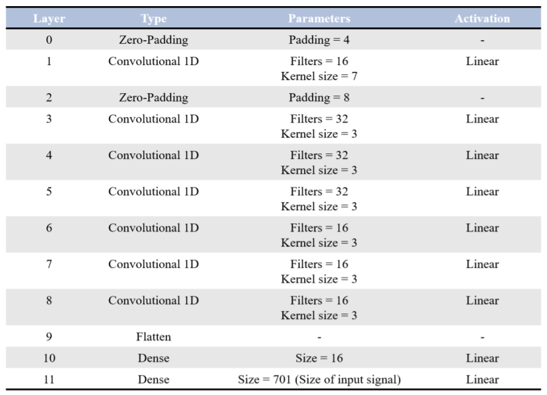



[Github Code Repository link](https://github.com/SiddharthSaravanan/MLforSHM)
 
[Download Project Report](http://SiddharthSaravanan.github.io/files/MLforSHMreport.pdf)

The objective of this project is to use Machine Learning algorithms to determine the structural health of a building. To do this, we take noisy accelerometer data from accelerometers placed on two adjacent floors and be able to accurately predict the status of the building. The status of the building can be one of 3 classes, Immediate Occupancy (IO), Life Safety (LS) or Collapse Prevention (CP). The status of the building is therefore represented as a 1-dimensional array of size 3 which uses one-hot encoding. To put it simply, the goal of the project is to take 2 noisy accelerometer readings and output a 1D array of size 3 which accurately represents the structural health of the structure.

Shown below is the architecture of the CNN used in this project.

