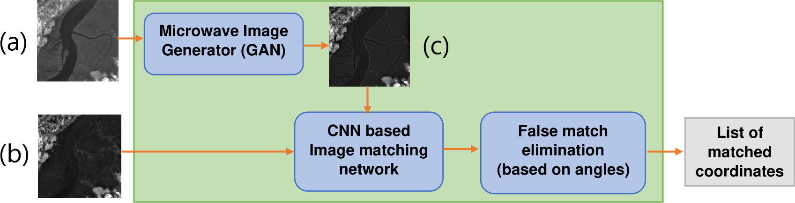
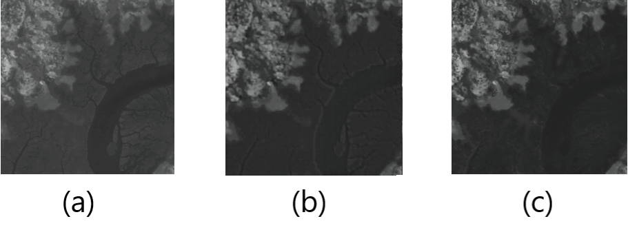
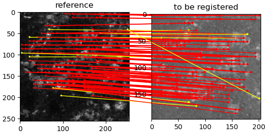



[preprint link](https://www.researchgate.net/publication/351437390_Deep_Learning_Framework_for_Optical_and_Microwave_Image_Matching)

In this work we create a Deep Learning model capable of registering optical and microwave remote sensing images of the same scene.<br\>
Shown below is the pipeline of our model.

We give the microwave and optical images of the same scene as input and the model generates as output a list of pairs of coordinates. Say, for example, that one of the pairs in the list is \[M : (120; 121), O : (500; 512)\]. This means that the algorithm detected a feature in the neighbourhood of coordinate (120; 121) in the microwave image and that its corresponding feature in the optical image was detected in the neighbourhood of coordinate (500; 512). Having a list of such matches gives us matching features and key points between the optical and microwave images that can be used for co-registration of the images.

The first part of the pipeline which is called the "Microwave Image Generator" is a GAN that is capable of taking an optical image and producing its corresponding microwave image.

In the figure shown below, image (a) is an example optical image, image (b) is the microwave image that was generated by the GAN and image (c) is the ground truth microwave image of the same scene of image (a). 

We do this as we can yield better results when we compare a generated microwave and the input microwave image rather than a the input optical and input microwave image directly.

Next, we pass both the generated and input microwave images into the "Image Matching Network". This network is a CNN that is capable finding matching features between two images, as shown below.

Each line going from one image to the other denotes a matching feature found in both the images.

As a final step, we remove some of the matches based on angles.

Once The CNN has performed the initial matching between the input microwave image and the generated microwave image, we attempt to identify and eliminate potential false
matches using a method of finding angles and z-scores.
As seen in Fig. 3, we draw line segments between the
matched points of the two images to denote the matched
features in the images. To identify whether a feature point
in the reference image (which has been matched to another
feature point in the secondary image) has been matched
falsely or not, we consider the k-nearest neighbouring feature
points of the point in consideration within the reference image
(Fig. 4) and we calculate the angles of the lines formed by
these k points and their corresponding matching points in the
secondary image (Fig. 5). We then normalize these k angles
to a normal distribution with $\mu$ = 0 and $\sigma$ = 1 using equation
$\frac{X-\mu}{\sigma}$
Finally, we perform the angle calculation for the point in
consideration. If the angle of the point in consideration is not
within the range of $\mu \pm (1.5)\sigma $, then we consider the point to
be falsely matched.

All these components together create an algorithm capable of accurately registering optical and microwave remote sensing images.
