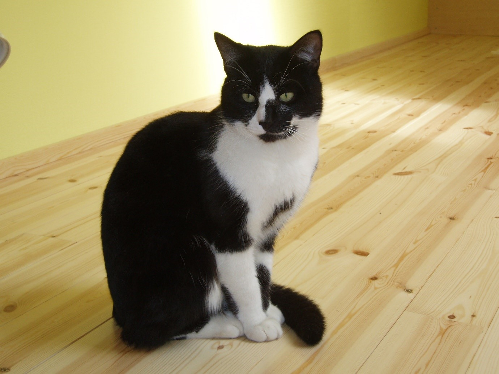
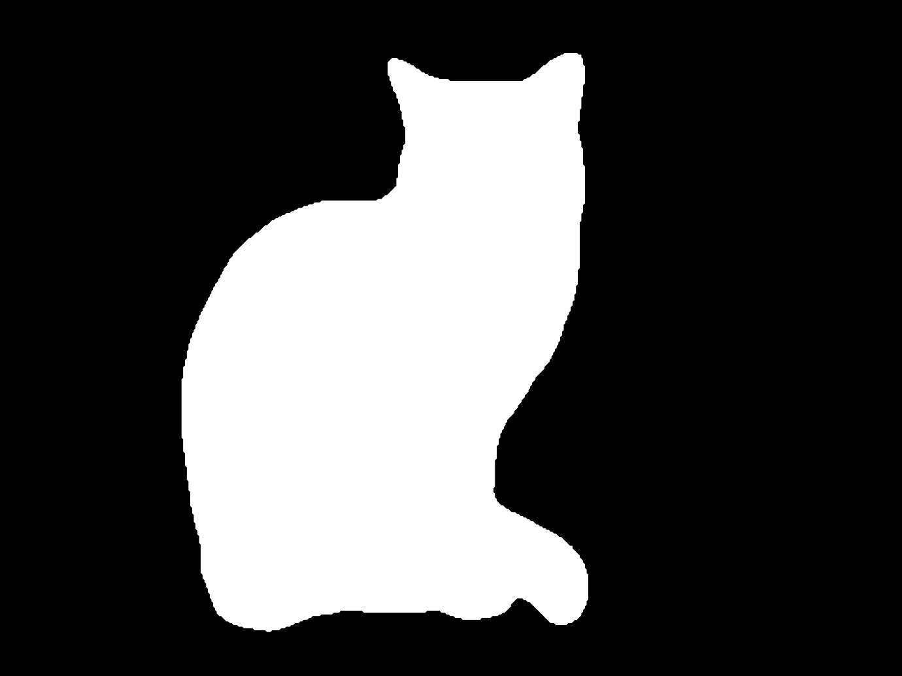
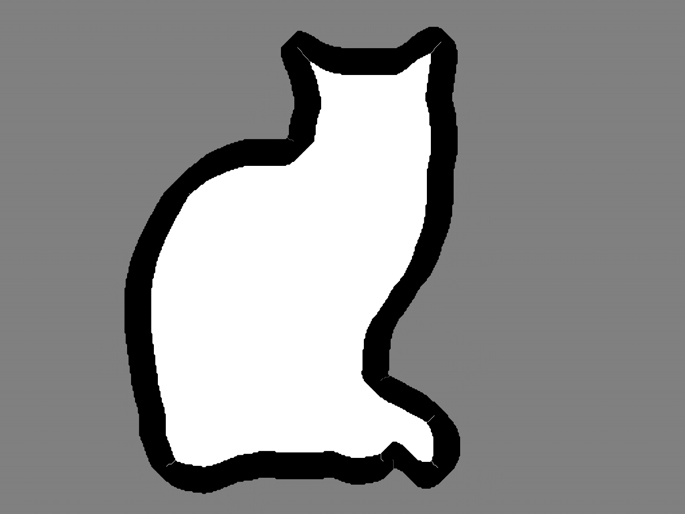



[Github Code Repository link]()
 
[arXiv preprint link]()

Deep Learning models for semantic segmentation are trained on low-resolution images and fail to segment high-resolution images. Training deep learning models on high resolution images however, is problematic due to hardware limitations and the scarcity of high-resolution datasets. A common workaround is to downsample the HD image, pass it through a model and upsample the segmentation results back to the original dimensions using nearest neighbour upsampling. However, this method provides poor results because downsampling the image, causes object boundary details to be lost. 
We find that while upscaling the segmentation estimates from low-resolution to high-resolution, the majority of incorrect estimates happen at the object boundaries.
 
 
Inorder to obtain accurate image segmentation on high-resolution images, we first pass the downsampled image through a deep learning image segmentation model (such as deeplabV3+ or PSPNet). We then upsample the output segmentation back to the original size. Then, we refine the segmentations at the boundary regions.
 
 
This is achieved by using the random walker algorithm. We use the upsampled segmentation image to create object and background seeds for the algorithm. To generate the seeds, perform morphological thinning on the foreground and the background with an appropriate structuring element and take their union to generate the seed image. In other words, If set $F$ is the foreground and set $G$ is the background of the upsampled binary image and $B$ is the set of eight 9x9 structuring elements, then $foreground \; seeds = (F \otimes \{ B \})$ is performed for some $n$ number of passes and $background \; seeds = (G \otimes \{ B \})$ is also performed for some $n$ number of passes. The non-seed pixels (that the random walker algorithm will classify as belonging either to the foreground or background) are the pixels that were removed through thinning, i.e $nonseed \; pixels = 255-(foreground \; seeds \;  \cup \; background \; seeds)$.
 
 
An example of this is shown below. Figure 1 shows a HD image that we want to perform image segmentation on. Figure 2 shows the upsampled output after passing the downsampled image through a deep learning model. Figure 3 shows the background and foreground seeds obtained after thinning.

Figure 1.
 
 

Figure 2.
 
 

Figure 3.
 
 

The gray regions on figure 3 represents the seed pixels for the backgroung, while the white pixels represent the seed pixels for the object/foreground. The black pixels represent non-seed pixels which will be classified as either background or foregroung pixels through the random walker algorithm.
 
 
For more details, refer to the [preprint]() on arXiv.
